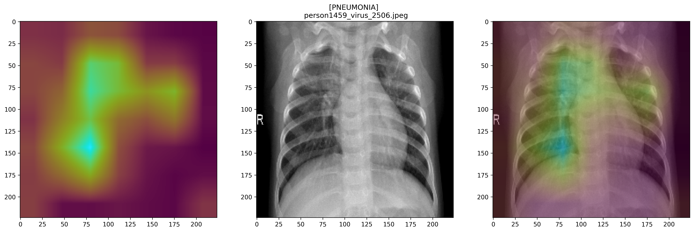
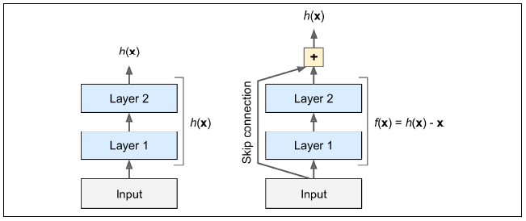

# Pneumonia Detection Using Convolutional Neural Network

Author: **Chi Bui**

## This Repository

### Repository Directory
```
├── README.md               <-- Main README file explaining the project's business case,
│                           methodology, and findings
│
├── notebook                <-- Jupyter Notebooks for exploration and presentation
│   └── exploratory         <-- Unpolished exploratory data analysis (EDA) and modeling notebooks
│ 
│
├── dataframes              <-- records of all models' performance metrics & propability predictions 
│                               on validation set
│
├── reports                 <-- Generated analysis
│   └── report-notebook     <-- Polished final notebook
│   └── presentation.pdf    <-- Non-technical presentation slides
│ 
│
└── images                  <-- Generated graphics and figures to be used in reporting
```


### Quick Links
1. [Final Analysis Notebook](./reports/report-notebook.ipynb)
2. [Presentation Slides](./reports/presentation.pdf)


## Overview
(source: [Wikipedia](https://en.wikipedia.org/wiki/Pneumonia))

**Pneumonia** is an inflammatory condition of the lung primariy affecting the small air sacs known as **alveoli** in one or both lungs. It can be caused by infection with **viruses** or **bacteria**; and identifying the pathogen responsible for Pneumonia could be highly challenging. 

Diagnosis of Pneumonia often starts with medical history and self reported symptoms, followed by a physical exam that usually includes chest auscultation. A **chest radiograph** would then be recommended if the doctors think the person might have Pneumonia. In adults with normal vital signs and a normal lung examination, the diagnosis is unlikely. 


## Business Problem

Pneumonia remains a common condition associated with considerable morbidity and mortality - each year it affects approximately 450 million people, and results in about 4 million deaths. Outcome is often improved by early diagnosis, while the traditional radiograph assessment usually introduces a delay to the diagnosis and treatment. Therefore, fast and reliable computer-aided diagnosis of the disease based on chest X-ray could be a critical step in improving the outcomes for Pneumonia patients. 

For this project, I have developed and evaluated various Convolutional Neural Networks that can quickly classify Normal vs. Pneumonia frontal chest radiographs. The implementation of these models could help alert doctors and radiologists of potential abnormal pulmonary patterns, and expedite the diagnosis.


## Dataset

The dataset was collected from **Guangzhou Women and Children’s Medical Center** (Guangzhou, China) pediatric patients of one to five years old from.

The dataset is available on:
- [Mendelay Data](https://data.mendeley.com/datasets/rscbjbr9sj/3)
- or [Kaggle](https://www.kaggle.com/paultimothymooney/chest-xray-pneumonia)

The diagnoses for the images were then graded by two expert physicians, and checked by a third expert before being cleared for training the AI system.

### Dataset Structure

The dataset is divided into 2 directories:
- train
- test

Within each directory, there're 2 sub-directories: 
- NORMAL
- PNEUMONIA

and the labels for the images are the names of the corresponding directories they're located in.

```
chest_xray
    │
    ├── test
    │   ├── NORMAL
    │   │   └── image_01.jpeg
    │   └── PNEUMONIA
    │       └── image_02.jpeg
    └── train
        ├── NORMAL
        │   └── image_01.jpeg
        └── PNEUMONIA
            └── image_02.jpeg

```

### Data Preview


Although a printout of these images' shapes indicate that they're composed of 3 channels (RGB), a comparison of 3 layers' numerical values are exactly the same.


For this reason, moving forward, I would set `ImageDataGenerator()`'s `color_mode` to `grayscale` to downsize the dataset, while still retaining the same amount of information.

### DataFrames

#### Class Composition
In order to easily analyze this dataset's class composition and evaluate its balancedness, I would create a dataframe with 2 columns:

- **1st column**: name of the image file - called `image`
- **2nd column**: label for that image - called `label`

There are 5232 images in the training set (with an approximately 3:1 class ratio), and only 624 in test set (with less than a 2:1 ratio).

In addition, due to a potential "mislabeling" issue in the test data (which has been raised about this dataset in various different platforms), I'm going to concatenate both sets together and re-split them into Train/Validation/Test later to ensure data consistency.

After joining, in total we have 5856 images, out of which Pneumonia takes up 72.9%.


#### Pneumonia Types

Within the Pneumonia class itself, there are two different types: Bacteria and Virus. These 2 subclasses that usually observed some distinctive characteristics:
- **Bacterial pneumonia** typically exhibits a focal lobar consolidation
- whereas **Viral pneumonia** manifests with a more diffuse ‘‘interstitial’’ pattern in both lungs

These differences would potentially impact the models' capabilities to differentiate the X-ray images; therefore it might be valuable to include this information in the model evaluation. This would not be the main focus of this project, but it would certainly provide some information for us to dig deeper into this topic in the future, and perhaps train models to classify different types of Pneumonia.


4273 datapoints in our master dataset are categorized as PNEUMONIA, which accounts for roughly 73% of the whole set: 

- Roughly 2/3 of the Pneumonia X-ray images are Bacterial Pneumonia
- The other 1/3 are Viral

This means that we're working with a highly imbalanced dataset, and I would need to counter this by assigning class weights or incorporating some image augmentation methods later. Our models are also going to be less exposed to Viral Pneumonia, and might struggle with these X-ray more than with Bacterial.

### Data Splitting

Using `sklearn`'s `train_test_split`, I then split the master dataframe into 3 smaller sets:
- Training (`train_df`) - used for fitting models directly
- Valuation (`val_df`) - used for model tuning during iterations
- Test  (`test_df`) - used for final model evaluation

My models would be trained mainly on the training set, and also exposed to the valuation set but only for the purpose of evaluating the model on a small unseen dataset.

### Data Visualization


## Modeling

### Convolutional Neural Networks (CNN)
(Source: **Hands-on Machine Learning with Scikit-Learn, Keras & TensorFlow** - Aurelien Geron)

Convolutional Neural Networks have proved to be highly accurate with Image Recognition tasks, partly due to its resemblence of nature.

David H. Hubel and Torsten Wiesel's experiments on cats (in 1958 and 1959), and on monkeys a few years later has led them to discover some crucial insights into the structure of the visual cortex:
- They found out that many neurons in the visual cortex have a small ***local receptive field*** (which means they only react to visual stimuli in a limited region of the visual field). The receptive fields of different neurons may overlap, and together they tile the whole visual field.
- In addition, some neurons react only to images of horizontal lines, while others react to lines with different orientations (two neurons with the same receptive field might detect different line orientations). 

These studies of the visual cortex had inspired the **neocognitron** in the 80s, which gradually evolved into modern **convolutional neural networks**.

1. **Convolutional Layers**
Convolutional Layer is the building block of CNN. Neurons in the 1st convolutional layer are only connected to pixels in their receptive field. Then each neuron in the 2nd convolutional layer is only connected to neurons within their receptive field in the 1st layer, and so on. This hierarchical structure resembles real-world images 

2. **Pooling Layers**
The goal of pooling layer is to *subsample* the input image inorder to reduce computational load, memory usage, and number of parameters.

### Metrics
Since the objective of this project is to create a model that helps speed up the diagnosis of Pneumonia and the Accuracy for a highly imbalanced dataset could be skewed, prioritizing a high Recall score and reducing the number of False Negatives (actual Pneumonia cases that are classified as Normal) would be my main goal as I go through model iterations.

Since we're working with an imbalanced dataset with the majority being Pneumonia, a model that predicts everything as Pneumonia would have approx. 73% accuracy (depending on the class ratio of the evaluation set this might vary more or less). If not corrected, models trained on the imbalanced dataset would have the tendency to predict more of the abundant class (which is 1-PNEUMONIA in this case). 

From the business stand point, a model trained on imbalanced data like this is not entirely bad, because it would reduce the risk of mis-classifying PNEUMONIA cases as NORMAL. Although that could cause some inconveniencies to the patients, it would helps ensure higher chance of catching the disease early. However, not correcting class imbalance could also lead to models not learning to differentiate images of the 2 classes efficiently and not picking up the important features of the images.

### Final Model: Transfer Learning with ResNet50

**ResNet** or **Residual Network** is one of the most powerful deep neural networks: it helped Kaiming He et al. win the ILSVRC in 2015. The winning variant used an extremely deep CNN with 152 layers; but I'm just going to use ResNet50, which is composed of 48 Convolutional Layers, 1 Max Pool, and 1 Average Pool layer.

Deeper networks can usually represent more complex features, therefore increase the model robustness and performance. However, research has found that stacking up more and more layers creates accuracy degradation (accuracy values start to saturate or abruptly decrease), which is caused by the vanishing gradient effect.

As the number of layers increases, the gradient gets smaller and smaller as it reaches the end layers of the network. Therefore, the weights of the initial layers will either update very slowly or remains the same, which means the initial layers of the network won’t learn effectively. 

The key to being able to train deep network effectively is **skip connection** or **shortcut connection** between the layers:
The idea behind it is to add the input feeding into a layer to the output of a layer higher up the stack.
The goal of training a neural network is to make it model a target function `h(x)`. Adding the input `x` to the output of the network would then force the network to model `f(x) = h(x) - x` rather than `h(x)`. This helps speed up training considerably and the networks can start making progress even in several layers have not started learning yet.



